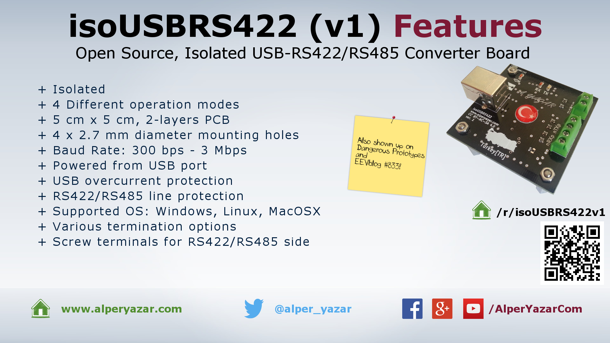
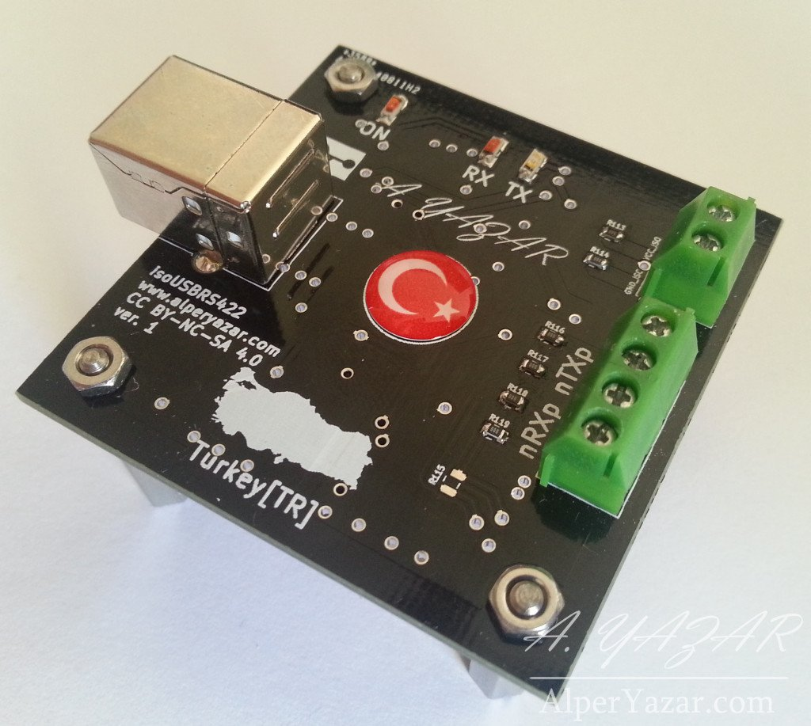
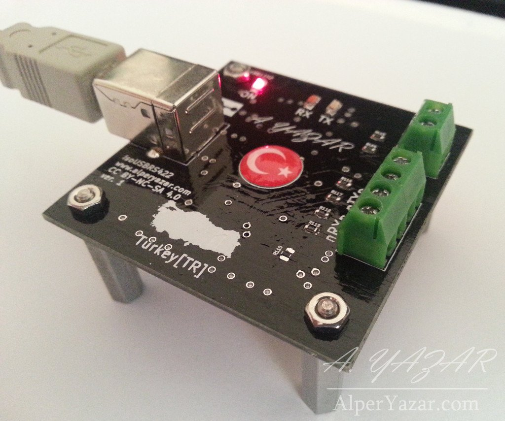
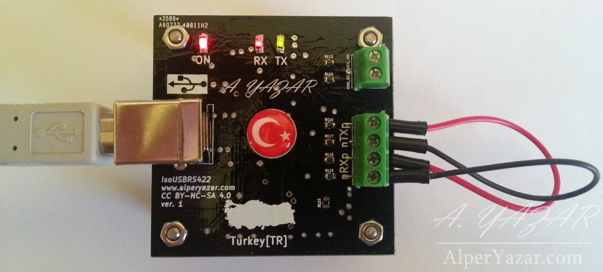
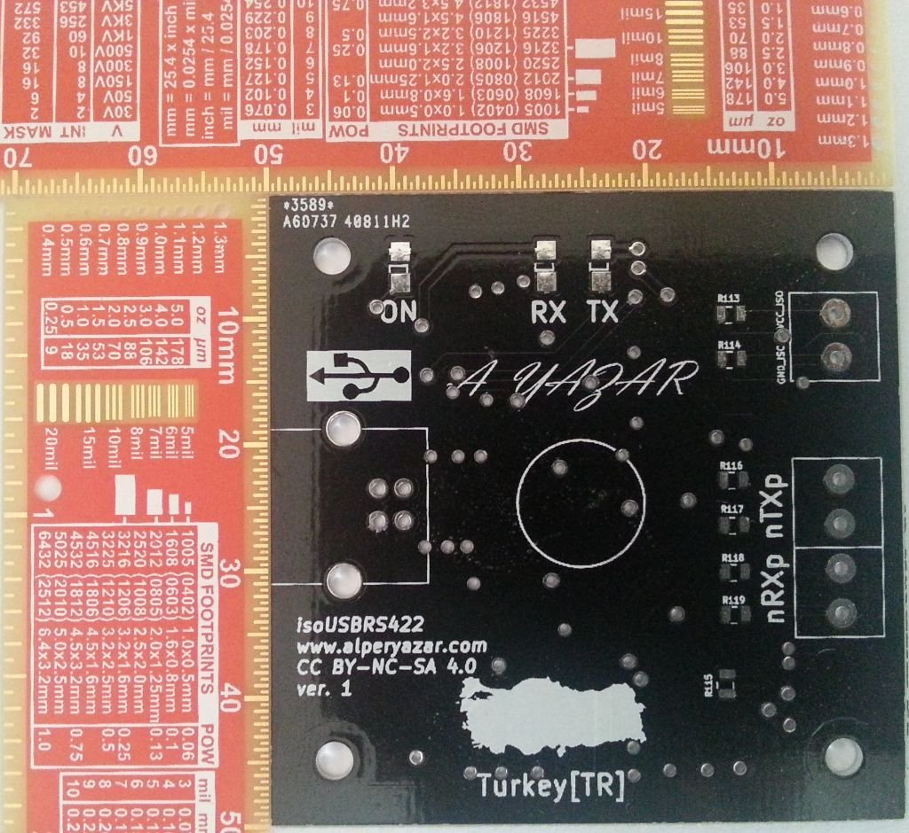
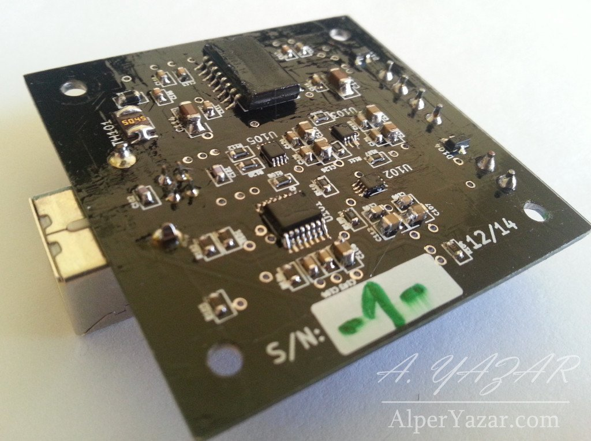

# isoUSBRS422

Links:

|               |               |
| ------------- |-------------|
| Up-to-date BOM (with price) | [https://octopart.com/bom-tool/p8YATXJo](https://octopart.com/bom-tool/p8YATXJo) |
| Known Issues | [https://github.com/alperyazar/isoUSBRS422/issues](https://github.com/alperyazar/isoUSBRS422/issues)
| Photo Gallery | [https://www.flickr.com/photos/134583834@N07/sets/72157658466808770/](https://www.flickr.com/photos/134583834@N07/sets/72157658466808770/) |
| Hackaday.io | [https://hackaday.io/project/3943-isousbrs422](https://hackaday.io/project/3943-isousbrs422) |
| Project Page on My Website (may contain additional materials) | [https://www.ayazar.com/project/isousbrs422](https://www.ayazar.com/project/isousbrs422) |

> :information_source: isoUSBRS422v1 is on **EEVblog Mailbag** and **Dangerous Prototypes.** See [On The Web](#on-the-web) section at the bottom for details.

isoUSBRS422 is an **isolated** USB <-> RS422/RS485 converter board (~5x5 cm). It should work with Windows, Linux and MacOSX (not fully tested for all operating systems by me).

**THIS PROJECT IS PUBLISHED UNDER CC BY-NC-SA 4.0 LICENSE**

**AS IS, ABSOLUTELY NO WARRANTY**

## Features

Here is the summary of features in “catalog” style:

*Summary of isoUSBRS422 features*

Here is the introduction video:

")

* **Isolated** 5000 Vrms (IC specification, not tested by me)
* **4 different modes** RS-422, RS-485 4-wire, RS-485 2-wire, RS-485 2-wire w/echo suppression
* **5 cm x 5 cm, 2-layers PCB**
* **4 x 2.7 mm diameter mounting holes** Electrically floating
* **Baud Rate: 300 bps - 3 Mbps** Baud Rate = 3000000 / (n + x) where ‘n’ can be any integer between 2 and 16,384 and ‘x’ can be a sub-integer of the value 0, 0.125, 0.25, 0.375, 0.5, 0.625, 0.75, or 0.875. When n = 1, x = 0, i.e. baud rate divisors with values between 1 and 2 are not possible.
* **Powered from USB port** No external power supply is required. 5V from USB port is sufficient to operate the device.
* **USB overcurrent protection** Yes, by a polyfuse
* **RS-422/RS-485 line protection** Yes, it should meet IEC 61000-4-2, 61000-4-4 and IEC 61000-4-5 (IC specification, not tested by me)
* Supported OS: **Windows, Linux, MacOSX**
* **Various termination options** Different termination topologies can be selected by changing some passives on the component side using solder and iron! (Sorry, no dip switches)
* **Screw terminals for RS-422/RS-485 side**
* **LED indicators: Power, Transmit, Receive**

## What is isoUSBRS422?

As I said, basically it is an USB ↔ RS-422/RS-485 converter board. It can be used to communicate devices with RS-422/RS-485 interface by using a USB port of PC. Also, ground of USB port is isolated from ground of RS-422/RS-485 channel. It may help you to prevent [ground loops](https://en.wikipedia.org/wiki/Ground_loop_%28electricity%29) in large systems. See [Galvanic isolation](https://en.wikipedia.org/wiki/Galvanic_isolation) for further explanation. I will explain technical details later.

isoUSBRs422 is my first open source hardware and also KiCad experience. I did some boards for my daily job previously, but I never published them in public domain. So, I decided to do "something" to gain experience about open source publishing and low cost PCB production. Here there are some photos:

## Why

### Why did I design an isolated USB ↔ RS-422/RS-485 converter board?

As I explained previously, I wanted to design and publish "something". I use USB ↔ RS-422 converter devices for my daily job heavily. I checked PCB manufacturers and decided to try Dirtypcbs. Dimension limit for the cheapest option is 5 cm x 5 cm and I decided to stick to this limit. I thought that I can design an isolated USB <-> RS-422 converter board within in this size limit and use it for my daily job. So I did it.

### Why did I chose the name isoUSBRS422? Does this board support RS-485 in addition to RS-422, right?

Yes, it supports both protocols. My initial goal was designing an isolated USB ↔ RS-422 converter board. Because I use RS-422 mainly not RS-485. However after design I noticed that it can also be used as an RS-485 converter. Also a name like *isoUSBRS422-485* is quite long for a board name.

### Why did I use KiCad?

Couple of years ago, I designed 3 different boards for my project design course in collage using DipTrace. DipTrace is great and I would continue to use it if I didn’t decide to publish my project and make it open source. DipTrace has *freeware* version for non-commercial users. However, this version has limitation on number of total pins on a single PCB. I think that software used for an open source project should be free (as in beer and freedom) as much as possible. Also, I had to create some parts in library for this project. If I use DipTrace, later I may hit the pin limit for my other projects and I have to move another software. For these reasons, I eliminate Eagle. I think that, it is easier to learn and use DipTrace than Eagle.

From *free* PCB design softwares, I tried gEDA and KiCad. I encountered some stability issues in gEDA then I selected to use KiCad. This is my first KiCad and experience and now I am happy with my decision. I recommend KiCad. It has quite good documentation and there are great videos on YouTube explaining almost all aspects of the software. Also there are active helping forums on the internet.

### Why the heck did I select a USB chip from FTDI? Don’t I know that they did stupid things in the past? Am I supporting them?

Yes, I know and I am not an FTDI fanboy. For those who don’t know the subject:

and

[http://hackaday.com/2014/10/22/watch-that-windows-update-ftdi-drivers-are-killing-fake-chips/](http://hackaday.com/2014/10/22/watch-that-windows-update-ftdi-drivers-are-killing-fake-chips/)

started to desing and selected to components prior to FTDI thing. I learned the issue in the beginning of the layout. I was very excited to finish my board and decided to finish it. So, that’s the story. Now, I can’t proudly say that “Hey, I am using an FTDI chip on my board”. I know that, many of hackers and makers encountered problems due to stupidity of this company. Since this is an open source project and aims makers especially, I am not very happy with this chip. But this is the case.

## Do It Yourself (DIY)

> :warning: AS IS, ABSOLUTELY NO WARRANTY. TAKE YOUR OWN RISK

Your read the features list and are fascinated about the project (LOL). You look forward to make your own isoUSBRS422 board and use it in your projects. Here is the good new: This is an open source project and you can make your own copy for non-commercial purposes!

> :information_source: This project is published under CC BY-NC-SA 4.0 license. It means that you can make your own copy for non-commercial purposes. Even, you can modify the project files, ex. PCB, if you refer to this original work properly and redistribute your version with the same license. See [https://creativecommons.org/licenses/by-nc-sa/4.0/](https://creativecommons.org/licenses/by-nc-sa/4.0/) for further details. Contact if you have any questions.

> :information_source: As I said in videos (see below), I may have some extra PCBs or even components in my hand. I may able to send you if you REALLY want to make your own board, free of charge. Please contact if you are interested in.

## Video Tutorials

I prepared 6 tutorial videos with total runtime ~1.5 hours (!) for makers. Below, videos are given in order. Click images to watch the videos. Also you can find a ordered playlist here: [https://www.youtube.com/watch?v=EZh2zi6m1yI&list=PLr5LL6z9GIeGnNSeiEEnGr73dqn5cAOdi](https://www.youtube.com/watch?v=EZh2zi6m1yI&list=PLr5LL6z9GIeGnNSeiEEnGr73dqn5cAOdi)

### Part 0 - Introduction

")

*Click on the image to watch the video*

### Part 1 - Features

")

*Click on the image to watch the video*

### Part 2 - Project Files

")

*Click on the image to watch the video*

### Part 3 - Board Production

")

*Click on the image to watch the video*

### Part 4 - Driver Installation, Programming, Functional Verification

")

*Click on the image to watch the video*

### Part 5 - Operation Modes

")

*Click on the image to watch the video*

### Part 6 - Known Issues

")

*Click on the image to watch the video*

## On The Web

isoUSBRS422 project is also shown up on some websites.

### Dangerous Prototypes

[Blog post of Dangerous Prototypes about isoUSBRS422 project](http://dangerousprototypes.com/2015/12/17/isousbrs422-an-open-source-isolated-usb-rs422rs485-converter-board/)

### EEVblog

*Click on the image to watch the video*

isoUSBRS422v1 board is shown up in [EEVblog #833 - Mailbag](https://www.youtube.com/watch?time_continue=822&v=dXbbJOH59oo) episode between **13:42 - 18:26**.

## Folder Structure

* `BOM` Contains bill of materials of board

* `Driver` Contains necessary drivers. Online Windows 7 (and probably newest versions) should install driver automatically. If you are running on an offline machine you may use drivers at that folder. However, I strongly recommend to get the newest driver from USB chip vendor website: [http://www.ftdichip.com/Drivers/VCP.htm](http://www.ftdichip.com/Drivers/VCP.htm) I won't update drivers at that folder when FTDI publishes new drivers. They are latest drivers at that time.

* `Firmware` Contains profile file for utility called FT_Prog (contains in Utility folder). Once you finish isoUSBRS422 board, FT230x will not work as RS422/RS485 converter. This chip should be programmed only once. You may use the given profiles for proper operation.

* `Gerber` Contains Gerber files for PCB production. You may produce exactly same board as mine using these files.

* `KiCad` Contains KiCad project files. My KiCad version is (2013-07-07 BZR 4022)-stable. You should able to open project files and edit according to your needs (please consider license).

* `PCB` Contains ZofzPCB (see: [https://www.ayazar.com/nb/r/zofzpcb/](https://www.ayazar.com/nb/r/zofzpcb/)) rendered board file and some computer generated images of PCB.

* `Schematic` Contains PDF of schematic.

* `Utility` Some programs to program isoUSBRS422 board an test it.

*You are always welcomed to contact me.*
